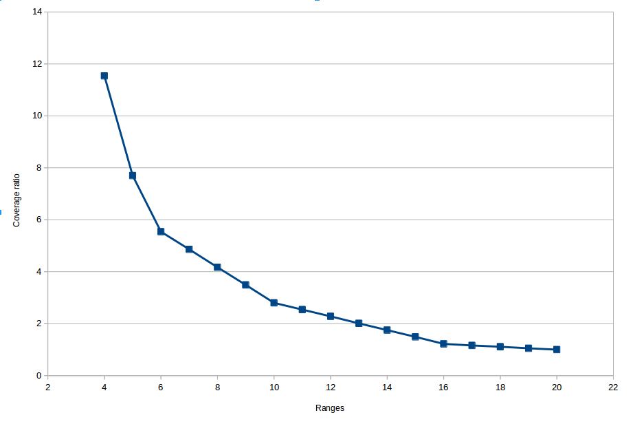

# hilbert-curve
<a href="https://github.com/davidmoten/hilbert-curve/actions/workflows/ci.yml"></a><br/>
[](https://maven-badges.herokuapp.com/maven-central/com.github.davidmoten/hilbert-curve)<br/>
[](https://codecov.io/gh/davidmoten/hilbert-curve)<br/>

Java utilities for 

* transforming distance along an N-dimensional Hilbert Curve to a point and back.
* bounding box (N-dimensional) query support (bounding box is mapped to a number of intervals on the hilbert index for single column lookup)

Features

* supports multiple dimensions
* method chaining
* renders in 2-dimensions
* benchmarked with `jmh`
* [efficiently finds Hilbert curve index ranges for bounding box queries](#querying-n-dimensional-space)

Status: *deployed to Maven Central*

Maven [reports](https://davidmoten.github.io/hilbert-curve/index.html) including [javadocs](https://davidmoten.github.io/hilbert-curve/apidocs/index.html)

See also [sparse-hilbert-index](https://github.com/davidmoten/sparse-hilbert-index).

Background
-------------
A [Hilbert curve](https://en.wikipedia.org/wiki/Hilbert_curve) is a continuous fractal space-filling curve first described by David Hilbert in 1891.

This library supports *approximations* to the Hilbert curve. *H<sub>n</sub>* is the n-th approximation to the Hilbert curve and is a path of 2<sup>n</sup>-1 straight line segments of length 1.

A Hilbert curve can be used to index multiple dimensions and has useful locality properties. In short, 

* *Points with indexes close to an index will be close to the point corresponding to that index.*

**Figure 1. 2D Hilbert curves with 1 to 6 bits (H<sub>1</sub> to H<sub>6</sub>)**

| | |
| --- | --- |
|   |  
|   |  
|   |  

```java
HilbertCurveRenderer.renderToFile(bits, 200, filename);
```

**Figure 2. 2D Hilbert curves with 1 to 4 bits colorized and labelled**

| | |
| --- | --- |
|   |  
|   |  

```java
HilbertCurveRenderer.renderToFile(bits, 600, filename, Option.COLORIZE, Option.LABEL);
```

**Figure 3. 2D Hilbert curves with 5 bits colorized and labelled**


```java
HilbertCurveRenderer.renderToFile(5, 1000, filename, Option.COLORIZE, Option.LABEL);
```

Getting started
-----------------
Add this to your maven pom.xml:

```xml
<dependency>
    <groupId>com.github.davidmoten</groupId>
    <artifactId>hilbert-curve</artifactId>
    <version>VERSION_HERE</version>
</dependency>
``` 

Usage
---------
### Limits
Maximum bits is 63 (index ranges from 0 to ~10<sup>19</sup>), max dimensions is not practically limited (sure you can specify 10<sup>9</sup> dimensions but that's a lot of data per point!).

### Small

The maximum index on the Hilbert curve is 2<sup>bits * dimensions</sup> - 1. If your 
`bits * dimensions` is <= 63 then you can increase performance and reduce allocations by using the <b>small</b> option which uses `long` values for indexes rather than `BigInteger` values. 
JMH benchmarks show up to 30% better throughput using `small`. 

### Points
The hilbert curve wiggles around your n-dimensional grid happily visiting each cell. The ordinates in each dimension are integers in the range 0 .. 2<sup>bits</sup>-1.
 
### Index from point

Get the index (distance along the curve in integer units) for a 2-dimensional point:

```java
HilbertCurve c = 
    HilbertCurve.bits(5).dimensions(2);
BigInteger index = c.index(3, 4);
```

Small option:

```java
SmallHilbertCurve c = 
    HilbertCurve.small().bits(5).dimensions(2);
//returns long rather than BigInteger
long index = c.index(3, 4);

```

### Point from index

Get the point corresponding to a particular index along the curve:

```java
HilbertCurve c = 
    HilbertCurve.bits(5).dimensions(2);
long[] point = c.point(22);
//or
long[] point = c.point(BigInteger.valueOf(22));
```

Small option:

```java
SmallHilbertCurve c = 
    HilbertCurve.small().bits(5).dimensions(2);
long[] point = c.point(22);
```

You can save allocations if you use this method (available on `HilbertCurve` and `SmallHilbertCurve`) to calculate a point:

```java
long[] x = new long[dimensions];
c.point(index, x);
```

Benchmarks indicate that throughput is increased about 25% using this method with the `small()` option. 

### Render a curve

To render a curve (for 2 dimensions only) to a PNG of 800x800 pixels:

```java
HilbertCurveRenderer.renderToFile(bits, 800, "target/image.png");
```

### Querying N-dimensional space
This is one of the very useful applications of the Hilbert curve. By mapping n-dimensional space onto 1 dimension we enable the use of range lookups on that 1 dimension using a B-tree or binary search. A search region represented as a box in n-dimensions can be mapped to a series of ranges on the hilbert curve. 

See [sparse-hilbert-index](https://github.com/davidmoten/sparse-hilbert-index) for a library that performs hilbert index queries on n-dimensional data (that can be stored in AWS S3 for instance).

#### Boundary algorithm for finding ranges
Given an n-dimensional search region **the exact hilbert curve ranges that cover the search region can be determined just by looking at the hilbert curve values on the perimeter (boundary) of the region**. *I didn't manage to find any discussion of this very useful fact on the web and am confused as to why this isn't covered in an accessible way somewhere. Surely this is not an unpublished discovery (because it's simple to show and seems obvious in retrospect). Let me know if you find discussion of this technique elsewhere!*

Let's prove this statement:

##### Boundary algorithm proof

**Lemma 1:** *The points corresponding to 0 on the hilbert curve and the maximum on the hilbert curve are vertices of the domain*. 

*Proof*: For two dimensions, note that the order 2 Hilbert curve has this property (this curve is just a U) and the known production rules for generating the Hilbert curve of order `n+1` from the curve of order `n` maintain the start and end positions of the curve on vertices. By induction the statement is true for 2 dimensions. The proof is similar for dimensions > 2.

**Lemma 2:** *Given the exact covering ranges of the Hilbert curve over a search region, the endpoints of those ranges must be on the boundary of the search region.*

*Proof*: We proceed with a proof by contradiction. Suppose an endpoint of one of the covering ranges was not on the boundary of the search region. Remember that the hilbert curve is a single continuous line visiting every point in the region. If the range endpoint in question is inside the search region then it must be the termination of the Hilbert curve but by Lemma 1 the Hilbert curve termination points are at the vertices of the domain which cannot be wholly inside the search region. 

##### Boundary algorithm description

Having proved the relationship of the boundary to the ranges we can create an algorithm for extracting the exact ranges. The hilbert curve values of the perimeter (an `n-1` dimensional surface) of a search box are calculated and put in a sorted list L. Then the values in L are paired with each other into ranges (and concatenated if they are adjacent) starting with the lowest value in L and checking if the next hop along the Hilbert curve in increasing value is on the perimeter, in the box or on the outside of the box. If the next value is outside the search box then we close the current range. If the value is on the perimeter then we add that value to the range and close off the range. If the value is strictly inside the search box then the next value in L must be where the curve exits (see Lemma 2) and we can add that value to the range and close it off. We continue adding ranges using the values in L and concatenate ranges when they are adjacent.

TODO amend the above description a bit to reflect how it is implemented in code (which is more efficient)

Note that a simplification for 2 dimensions *may* exist in that the list L doesn't need to be sorted but rather the minimum index on the perimeter found and then travel in which ever direction along the perimeter that has the closest initial index to that minimum index.

##### Boundary algorithm runtime complexity
The boundary of a d-dimensional region is comprised of `2d` *faces* each having `d-1` dimensions.

For a cube of side `w` in `d` dimensions the runtime complexity of obtaining the ranges is:

&nbsp;&nbsp;&nbsp;&nbsp;O(d(d-1)w<sup>d-1</sup>log(w))

TODO assess runtime complexity of range finding algorithm proposed by Lawder and King in [Querying Multi-dimensional Data Indexed Using the Hilbert Space-Filling Curve](https://sigmodrecord.org/publications/sigmodRecord/0103/3.lawder.pdf).

#### Query examples
Note that for the moment range queries have been implemented for the `SmallHilbertCurve` only. Raise an issue if you need them for the `HilbertCurve` object as well.

A lot of small ranges may be inefficient due to lookup overheads and constraints so you can specify the maximum number of ranges returned (ranges are joined that have minimal gap between them). 

```java
SmallHilbertCurve c = HilbertCurve.small().bits(5).dimensions(2);
long[] point1 = new long[] {3, 3};
long[] point2 = new long[] {8, 10};
// return just one range
int maxRanges = 1;
Ranges ranges = c.query(point1, point2, maxRanges);
ranges.stream().forEach(System.out::println);
```
Result:
```
Range [low=10, high=229]
```
We can improve the ranges by increasing `maxRanges`.


`maxRanges` is 3
```java
Range [low=10, high=69]
Range [low=122, high=132]
Range [low=210, high=229]
```

`maxRanges` is 6
```java
Range [low=10, high=10]
Range [low=26, high=53]
Range [low=69, high=69]
Range [low=122, high=132]
Range [low=210, high=221]
Range [low=227, high=229]
```

`maxRanges` is 0 (unlimited)
```java
Range [low=10, high=10]
Range [low=26, high=28]
Range [low=31, high=48]
Range [low=51, high=53]
Range [low=69, high=69]
Range [low=122, high=124]
Range [low=127, high=128]
Range [low=131, high=132]
Range [low=210, high=221]
Range [low=227, high=229]
```

When using querying do experiments with the number of bits and `maxRanges` (querying in parallel on each range) to get your ideal run time. 

The number of cells on the perimeter is width<sup>dimensions-1</sup> 2<sup>bits*(dimensions-1)</sup>. Once the perimeter values are collected the values are sorted so the computational complexity of the algorithm is O(Xlog(X)) where X = width<sup>dimensions-1</sup> 2<sup>bits*(dimensions-1)</sup>.

When we desire to restrict the number of ranges returned by a call to `SmallHilbertCurve.query` optimizations are applied so that missed coverage is minimal and the computational complexity is reduced.

### Spatio-temporal querying
Let's consider 3 dimensions of information being latitude, longitude and time. We'll index the full world for one day using 10 bits. When I search the Sydney (Australia) region for an hour at midday I get exact coverage with 20 ranges and those ranges are calculated in ~20ns. When we limit the number of ranges the ratio of coverage to exact coverage is below:

```
20 1.00
19 1.05
18 1.11
17 1.16
16 1.22
15 1.49
14 1.75
13 2.01
12 2.28
11 2.54
10 2.80
09 3.49
08 4.17
07 4.86
06 5.54
05 7.70
04 11.54
03 17.07
02 56.29
01 370.03
```
The data above in a graph (only for ranges >=4):



So if you use 12 ranges you will be returned points from a region that is 2.28 times bigger than required for exact coverage. If your points were uniformly distributed then you would throw away roughly half the returned points because they were outside your search region. However, the tradeoff of query overhead may mean this is worthwhile. Your own benchmarks are the only way to really check this because your datastore will have its own concurrency and overhead characteristics.

Note that if we expand the search to the entire region (give me every point) then the single range to cover it is returned in about 4.4s. As search boxes approach the dimensions of the entire domain some simplifications may be useful (TODO).

## Benchmarks

To run benchmarks:

```bash
mvn clean install -P benchmark
```

Result 7 May 2019,

Oracle Java 1.8u201, Intel® Xeon(R) CPU-E51650 v2 @ 3.50GHz:
```
Benchmark                                        Mode  Cnt      Score     Error  Units
Benchmarks.pointSmallTimes512                   thrpt   10   7053.853 ± 195.516  ops/s
Benchmarks.pointSmallTimes512LowAllocation      thrpt   10  10300.849 ± 231.470  ops/s
Benchmarks.pointTimes512                        thrpt   10   6461.033 ± 241.782  ops/s
Benchmarks.pointTimes512LowAllocation           thrpt   10   6382.470 ±  95.981  ops/s
Benchmarks.querySydney                          thrpt   10  52377.208 ± 619.063  ops/s
Benchmarks.querySydneyMaxRanges8                thrpt   10  48068.992 ± 902.004  ops/s
Benchmarks.roundTripSmallTimes512               thrpt   10   4128.441 ±  54.041  ops/s
Benchmarks.roundTripSmallTimes512LowAllocation  thrpt   10   5174.301 ±  70.768  ops/s
Benchmarks.roundTripTimes512                    thrpt   10   3196.380 ±  32.564  ops/s
Benchmarks.roundTripTimes512LowAllocation       thrpt   10   3191.937 ±  48.420  ops/s
Benchmarks.toIndexTimes512                      thrpt   10   6410.679 ± 291.534  ops/s
Benchmarks.toIndexTimes512Small                 thrpt   10   8375.023 ± 412.324  ops/s
```
Credits
----------
Primary credit goes to John Skilling for his article "Programming the Hilbert curve" (American Institue of Physics (AIP) Conf. Proc. 707, 381 (2004)).

Thanks to Paul Chernoch for his [StackOverflow answer](http://stackoverflow.com/questions/499166/mapping-n-dimensional-value-to-a-point-on-hilbert-curve) which got me most of the way there.

Dave Moten's contribution:

* translate the C# code to java (use `long` instead of `uint`)
* write the bit manipulations between the transposed index and the `BigInteger` index
* lots of unit tests
* made a simple easy-to-read API (hopefully)
* supplement with utilities for using a Hilbert Index with bounding box searches

References
-----------
* Skilling, John. "Programming the Hilbert curve." AIP Conference Proceedings. Vol. 707. No. 1. AIP, 2004.
* Lawder, Jonathan K., and Peter J. H. King. "Querying multi-dimensional data indexed using the Hilbert space-filling curve." ACM Sigmod Record 30.1 (2001): 19-24.

